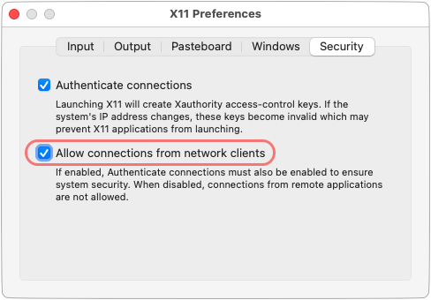

# DDEV Drupal Experience Builder Development Environment

This creates and configures a DDEV project for local Drupal [Experience Builder](https://www.drupal.org/project/experience_builder) (XB) module development. Specifically, it creates a Drupal site, clones and installs the module, sets up the front-end dependencies, and provides specialized development and testing tools.

>  **Notice:** This add-on is experimental. See [Support & community](#support--community) below.

- [Requirements](#requirements)
- [Installation](#installation)
- [Usage](#usage)
- [Updating](#updating)
- [Cypress](#cypress)
  - [Setup](#setup)
  - [Usage](#usage-1)
- [Support \& community](#support--community)
- [FAQ \& known issues](#faq--known-issues)
  - [Can I use Cypress on Linux or Windows?](#can-i-use-cypress-on-linux-or-windows)
  - [What if Cypress fails to start?](#what-if-cypress-fails-to-start)
  - [What if I get an HTTPS error?](#what-if-i-get-an-https-error)

## Requirements

Obviously, this requires a working [DDEV](https://ddev.com/) installation. It has been successfully tested with Orbstack, Colima, Rancher Desktop, and Docker Desktop.

## Installation

```shell
# Create a new directory for your new DDEV project.
# This can be any place you like. For example:
mkdir ~/Sites/xb-dev
cd ~/Sites/xb-dev

# Configure the new DDEV project.
ddev config --project-type=drupal --php-version=8.3 --docroot=web

# Create the Drupal project.
ddev composer create drupal/recommended-project:10.x@dev --no-install

# Install the add-on.
ddev add-on get TravisCarden/ddev-drupal-xb-dev

# Perform one-time setup operations.
ddev xb-setup
```

## Usage

The resulting DDEV project is just like any other one. Interact with it using the [the built-in commands](https://ddev.readthedocs.io/en/stable/users/usage/commands/), e.g., `ddev launch` to browse the site.

The installation process clones [the Experience Builder module](https://www.drupal.org/project/experience_builder) into `web/modules/contrib/experience_builder`. Develop and contribute from either location like you would any other Git repo for a normal Drupal project.

Any time you update the Experience Builder module or modify its front-end code, be sure to rebuild the UI app assets:

```shell
ddev xb-ui-build
```

When developing the React app, make sure to use the HTTPS URL of your DDEV project, then run:

```shell
ddev xb-ui-dev
```

To completely reinstall Drupal and the Experience Builder module, run:

```shell
ddev xb-site-install
```

For the full list of available Experience Builder commands, run this:

```shell
ddev | grep xb-
```

## Updating

Update the Experience Builder module clone just like you would any other Git repo. No tools are currently provided for updating Core.

## Cypress

Experience Builder uses [Cypress](https://www.cypress.io/) for front-end testing. It is currently only supported on macOS.

### Setup

> Carefully follow the below XQuartz configuration steps after installing it. Failure to do so will result in frustrating, difficult to debug problems.

Install XQuartz using Homebrew. See also https://www.xquartz.org/.

```shell
brew install xquartz
```

Configure XQuartz to allow connections from the host:

- Open XQuartz.
- Open Preferences ("XQuartz" > "Settings..." from the menu or `⌘,`).
- Go to the "Security" tab.
- Check the "Allow connections from network clients" checkbox.
- Log out and back in or restart your machine for the change to take effect.



### Usage

Run Cypress tests interactively:

```shell
ddev cypress open
```

Run them headlessly:

```shell
ddev cypress run
```

Run component/unit tests:

```shell
ddev cypress component
```

## Support & community

- [Experience Builder](https://www.drupal.org/project/experience_builder) module
- [#experience-builder](https://drupal.slack.com/archives/C072JMEPUS1) Drupal Slack channel
- Background on this add-on: [DDEV support for Cypress tests [#3458369] | Drupal.org](https://www.drupal.org/project/experience_builder/issues/3458369)

## FAQ & known issues

### Can I use Cypress on Linux or Windows?

No, not currently; and there are no plans at present to support it. See [Support & community](#support--community) above if you want to make a case for it.

### What if Cypress fails to start?

If you get an error like the below when attempting to run Cypress on macOS...

- Confirm that you have carefully followed _all_ the instructions under [Cypress](#cypress).
- See if your [Docker provider](#docker-provider) above requires any special configuration.

If these don't resolve the issue, see [Support & community](#support--community) above.

```
Cypress failed to start.

This may be due to a missing library or dependency. https://on.cypress.io/required-dependencies

Please refer to the error below for more details.

----------

[2536:0808/191430.352014:ERROR:bus.cc(407)] Failed to connect to the bus: Failed to connect to socket /run/dbus/system_bus_socket: No such file or directory
[2536:0808/191431.055343:ERROR:ozone_platform_x11.cc(240)] Missing X server or $DISPLAY
[2536:0808/191431.055373:ERROR:env.cc(255)] The platform failed to initialize.  Exiting.

----------

Platform: linux-arm64 (Debian - 12)
Cypress Version: 13.12.0
Failed to execute command node_modules/.bin/cypress open --browser electron --project .: exit status 1
Failed to run xb-cypress-open ; error=exit status 1
```

### What if I get an HTTPS error?

If this is your first time using DDEV, you may get an error like the following when you try to visit your site. If so, you need to configure your OS and browser to trust the root certificate authority that DDEV uses. See [DDEV Installation](https://ddev.readthedocs.io/en/stable/users/install/ddev-installation/).

```
This site can't be reached

The webpage at https://xb-dev.ddev.site/ might be temporarily down or it may have moved permanently to a new web address.

ERR_SSL_UNRECOGNIZED_NAME_ALERT
```
